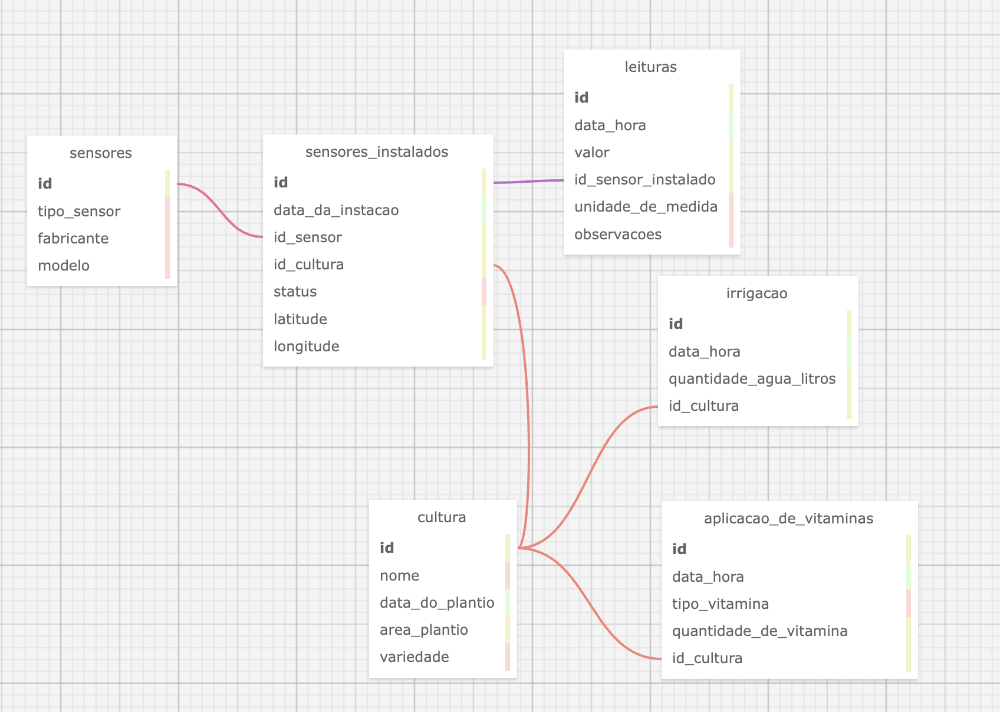

# Modelo Entidade-Relacionamento (MER) para Sistema de Monitoramento de Culturas

## Descrição do Sistema

Este sistema foi projetado para gerenciar e monitorar a irrigação e o uso de vitaminas em culturas agrícolas. O banco de dados contém tabelas para sensores, culturas, leituras de sensores, irrigação e aplicações de vitaminas.

## Entidades e Relacionamentos

### Entidades

- **Sensores**: Representa os dispositivos usados para monitorar as condições de cultivo.
- **Cultura**: Representa as diferentes culturas plantadas.
- **Leituras**: Registros das leituras realizadas pelos sensores instalados.
- **Irrigação**: Registros de irrigação realizados nas culturas.
- **Aplicação de Vitaminas**: Registros de aplicação de vitaminas nas culturas.
- **Sensores Instalados**: Representa a instalação de sensores em culturas específicas.

### Relacionamentos

| Relacionamento                                                   | Tipo |
| ---------------------------------------------------------------- | ---- |
| Um **sensor** pode ser instalado em várias **culturas**          | N:N  |
| Uma **cultura** pode ter várias **leituras**                     | 1:N  |
| Cada **leitura** está associada a um **sensor instalado**        | 1:N  |
| Cada **cultura** pode ter várias **irrigação**                   | 1:N  |
| Cada **irrigação** está associada a uma **cultura**              | N:1  |
| Cada **cultura** pode ter várias **aplicações de vitaminas**     | 1:N  |
| Cada **aplicação de vitaminas** está associada a uma **cultura** | N:1  |
| Um **sensor** pode ter várias **instalações**                    | 1:N  |

## Estrutura do Banco de Dados

| Tabela                     | Atributo               | Tipo de Dado |
| -------------------------- | ---------------------- | ------------ |
| **sensores**               | id                     | INTEGER (PK) |
|                            | tipo_sensor            | VARCHAR      |
|                            | fabricante             | VARCHAR      |
|                            | modelo                 | VARCHAR      |
| **cultura**                | id                     | INTEGER (PK) |
|                            | nome                   | VARCHAR      |
|                            | data_do_plantio        | DATE         |
|                            | area_plantio           | DOUBLE       |
|                            | variedade              | VARCHAR      |
| **leituras**               | id                     | INTEGER (PK) |
|                            | data_hora              | DATETIME     |
|                            | valor                  | DOUBLE       |
|                            | id_sensor_instalado    | INTEGER (FK) |
|                            | unidade_de_medida      | VARCHAR      |
|                            | observacoes            | MEDIUMTEXT   |
| **irrigacao**              | id                     | INTEGER (PK) |
|                            | data_hora              | DATETIME     |
|                            | quantidade_agua_litros | DOUBLE       |
|                            | id_cultura             | INTEGER (FK) |
| **aplicacao_de_vitaminas** | id                     | INTEGER (PK) |
|                            | data_hora              | DATETIME     |
|                            | tipo_vitamina          | VARCHAR      |
|                            | quantidade_de_vitamina | DOUBLE       |
|                            | id_cultura             | INTEGER (FK) |
| **sensores_instalados**    | id                     | INTEGER (PK) |
|                            | data_da_instacao       | DATE         |
|                            | id_sensor              | INTEGER (FK) |
|                            | id_cultura             | INTEGER (FK) |
|                            | status                 | VARCHAR      |
|                            | latitude               | DOUBLE       |
|                            | longitude              | DOUBLE       |

## Imagens do Modelo

